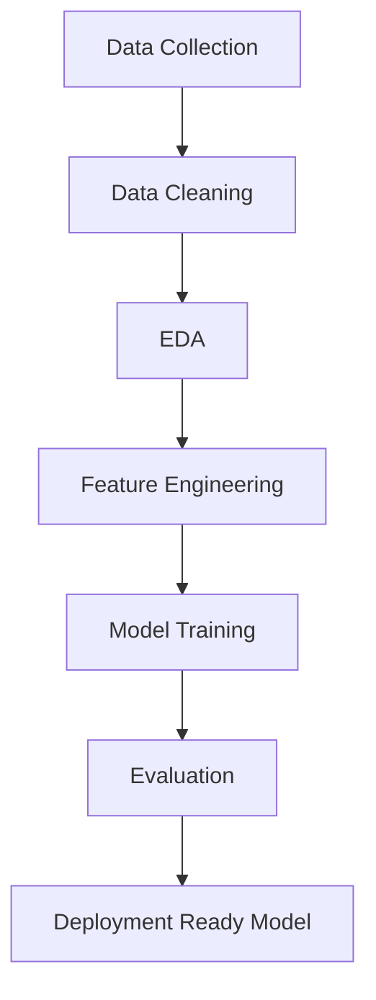

# 📈 Regression---Yes-Bank-Stock-Closing-Price-Prediction


---

## 🚀 Overview

This project predicts the **closing stock price of Yes Bank** using historical financial data and machine learning models. It demonstrates a complete ML pipeline — from **EDA to deployment-ready model**.

---

## 📊 Project Workflow



---

## 📂 Dataset Features

| Feature | Description            |
| ------- | ---------------------- |
| Date    | Time period            |
| Open    | Opening price          |
| High    | Highest price          |
| Low     | Lowest price           |
| Close   | Closing price (Target) |

---

## 📸 Key Visualizations

### 📉 Closing Price Trend


### 🔥 Correlation Heatmap


### 📊 Model Comparison


---

## 🧠 Models Implemented

| Model             | Description           |
| ----------------- | --------------------- |
| Linear Regression | Baseline model        |
| Decision Tree     | Handles non-linearity |
| Random Forest     | Best performing model |

---

## 📈 Evaluation Metrics

| Metric   | Meaning                |
| -------- | ---------------------- |
| R² Score | Model accuracy         |
| MAE      | Average error          |
| RMSE     | Penalizes large errors |

---

## 🏆 Best Model: Random Forest

✔ Highest accuracy
✔ Lowest error
✔ Handles complex patterns

---

## 📊 Model Performance

| Model             | R² Score | MAE      | RMSE     |
| ----------------- | -------- | -------- | -------- |
| Linear Regression | XX       | XX       | XX       |
| Decision Tree     | XX       | XX       | XX       |
| Random Forest     | ⭐ Best   | ⭐ Lowest | ⭐ Lowest |

---

## 💡 Key Insights

* Strong correlation between stock features
* Significant volatility observed
* Moving averages reveal trends
* Random Forest provides best predictions

---

## 🔮 Future Work

* Implement **LSTM (Deep Learning)**
* Add **News Sentiment Analysis**
* Deploy using **Streamlit**
* Real-time stock prediction

---

## 🛠️ Tech Stack

* Python 🐍
* Pandas, NumPy
* Matplotlib, Seaborn
* Scikit-learn

---

## ⚙️ Installation

```bash
git clone https://github.com/your-username/yes-bank-stock-prediction.git
cd yes-bank-stock-prediction
pip install -r requirements.txt
jupyter notebook
```

---

## 📦 Model Deployment

```python
import joblib

model = joblib.load('yes_bank_model.pkl')
prediction = model.predict([[Open, High, Low]])
```

---

## 👨‍💻 Author

**Akhil Pandey**
Aspiring Data Scientist

🔗 LinkedIn: https://www.linkedin.com/in/akhil-pandey-a6883b240

---

## ⭐ Show Your Support

If you like this project, give it a ⭐ on GitHub!
